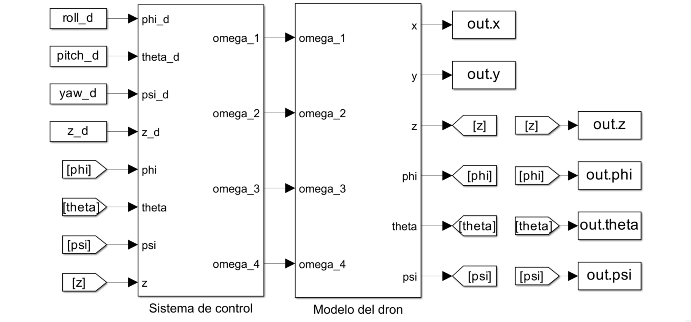
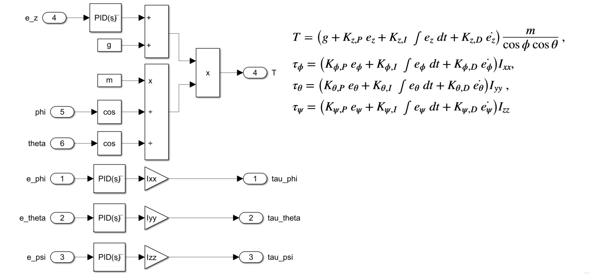
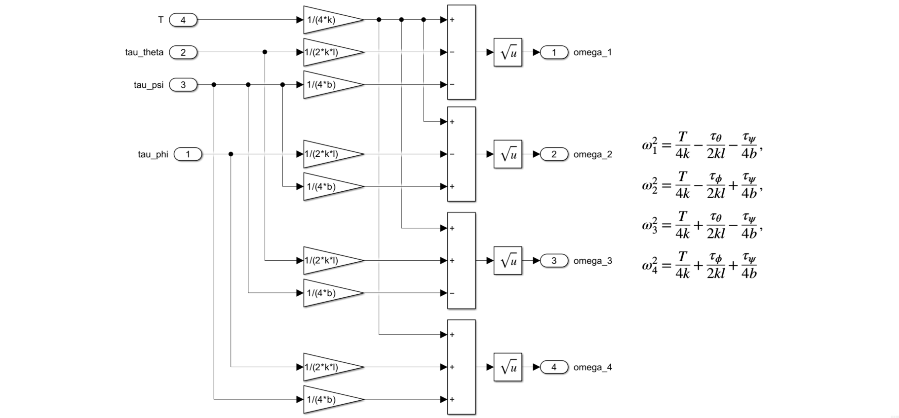
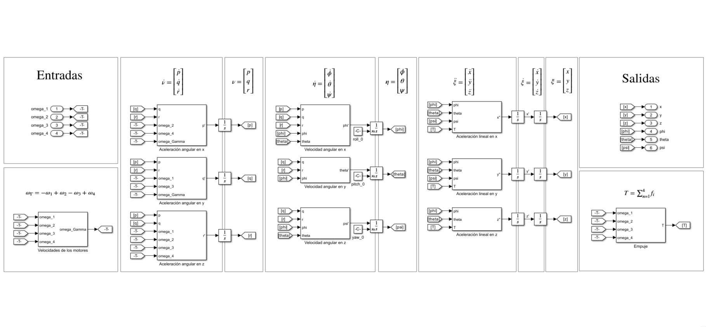

# Dron Eliminador de Plaga

Sistema de Control para la Eliminación de Pulgón Amarillo en Cultivos de Maíz por medio de un Dron Parrot Bebop 2.

Proyecto de [Laboratorio Integral de Control Automático](https://samp.itesm.mx/Materias/VistaPreliminarMateria?clave=MR3029&lang=ES#).

## Tabla de contenidos

- [Autoría](#autoría)
- [Estructura](#estructura)
- [Instalación](#instalación)
- [Licencia](#licencia)

## Autoría
Este proyecto fue desarrollado por Gerardo Domínguez, Vanessa Dorantes, Uziel Hernández, Carlos Diego y Emmanuel Ramírez en el Instituto Tecnológico y de Estudios Superiores de Monterrey bajo la supervisión de la Dra. Debbie Crystal Hernández y la Dra. Marybeth Flores.

## Estructura
El proyecto contiene tres carpetas que contienen la documentación en LaTeX ([``documentation``](documentation)), la simulación en MATLAB/Simulink ([``simulation``](simulation)) y la aplicación en MATLAB/Simulink y Python ([``application``](application)). Cada segmento del proyecto tiene su rama para el desarrollo.

### Documentación
Dentro de la carpeta de documentación se encuentran los siguientes archivos:

- El archivo [``main.tex``](documentation/main.tex) contiene el código de LaTeX para generar el PDF de documentación.
- El archivo [``main.bib``](documentation/main.bib) contiene la bibliografía del documento (se emplea formato APA).
- La carpeta [``build``](documentation/build) contiene el archivo [``main.pdf``](documentation/build/main.pdf) que corresponde al documento PDF de documentación.
### Simulación

La simulación está construida en MATLAB®/Simulink™ y está conformada por un Live Script de MATLAB® [``drone_parameters.mlx``](simulation/drone_parameters.mlx) que contiene los parámetros y condiciones iniciales para ejecutar la simulación, así como la ejecución del programa en Simulink™ [``drone_control_model.slx``](simulation/drone_control_model.slx) y las gráficas de salida.

El Live Script contiene las siguientes secciones:

- Limpieza del workspace.
- Definición de constantes generales.
- Definición de configuración inicial (ángulos de Euler iniciales y altura inicial del dron).
- Definición de la configuración deseada (ángulos de Euler deseados y altura deseada del dron).
- Ejecución de la simulación.
- Gráficas de posición lineal del dron en el espacio $xyz$, y $x$, $y$, $z$, $\phi$, $\theta$ y $\psi$ con respecto al tiempo.

Algunas capturas del programa en Simulink™ se presentan a continuación:

- Diagrama de bloques principal.

- Diagrama de bloques del sistema de control.

- Diagrama de bloques del control de torque.

- Diagrama de bloques del control de velocidad angular.

- Diagrama de bloques del modelo del dron.

### Aplicación
El proyecto tiene como trabajo futuro la implementación de la aplicación en el sistema físico del dron.

## Instalación
Este proyecto utiliza [LaTeX](https://www.latex-project.org/), [MATLAB®/Simulink™](https://www.mathworks.com/products/matlab.html) y [Python](https://www.python.org/). Son necesarios para la ejecución del proyecto, se recomienda consultarlos si no se encuentran instalados localmente.

### Requisitos de LaTeX
Este proyecto emplea los siguientes paquetes de LaTeX:

#### Generales
- [``inputenc``](https://www.ctan.org/pkg/inputenc) para aceptar la codificación ``utf8``.
- [``geometry``](https://www.ctan.org/pkg/geometry) para ajustar las dimensiones.

#### Lenguaje
- [``babel``](https://www.ctan.org/pkg/babel) para emplear el idioma español.
- [``csquotes``](https://www.ctan.org/pkg/csquotes) para incluir citas sensibles al contexto (requisito de ``babel``).

#### Figuras
- [``graphicx``](https://www.ctan.org/pkg/graphicx) como soporte mejorado para gráficos.

#### Citación
- [``biblatex``](https://www.ctan.org/pkg/biblatex) para emplear autocitación en formato APA.

## Licencia

[Apache 2.0](LICENSE) 